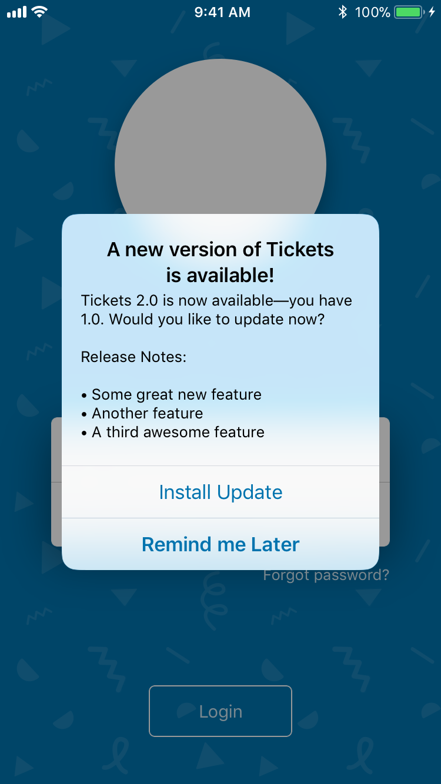
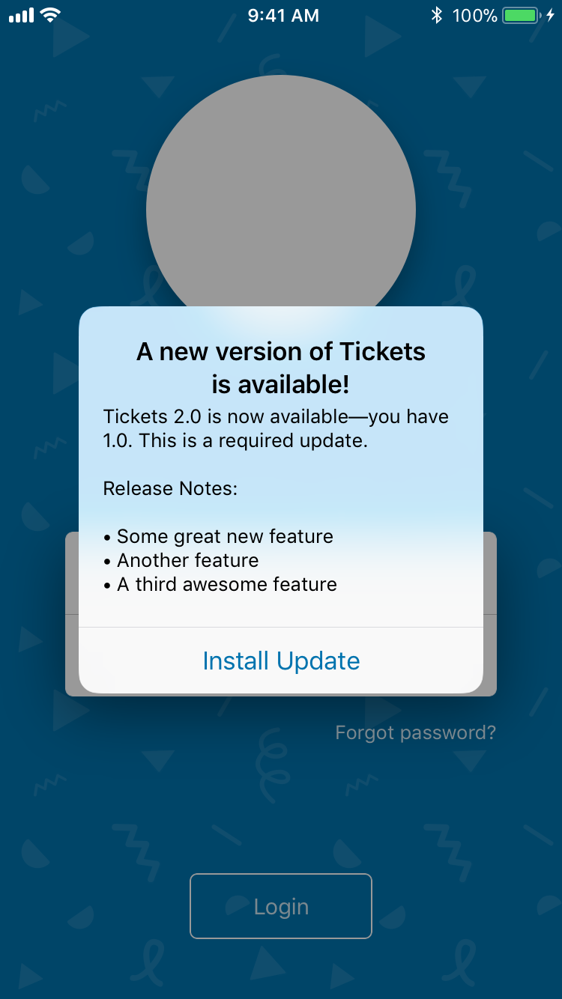
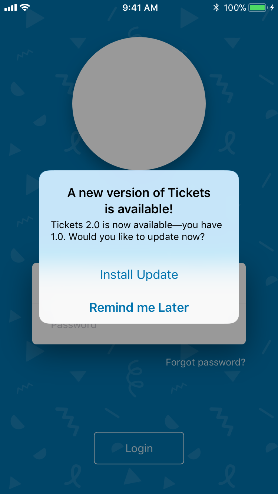

# Shine    [](https://cocoapods.org)
An Enterprise app update framework for iOS written in Swift

  

## Features

* Similar to the well-known [Sparkle framework](https://github.com/sparkle-project/Sparkle) for macOS in design and behavior.
* Easy to use. Setup with only a couple lines of code, and only needs a few static files hosted on a web server to operate.
* Uses RSS-based appcasts for release information. Appcasts are a de-facto standard supported by 3rd party update-tracking programs and websites.
* Stays hidden until second launch for better first impressions.
* Allows certain versions to be marked as a forced update for critical fixes and changes.
* Allows configuration of deployment targets for app versions so the user won't be bothered about an app update they can't use.
* Works with (but doesn't require) new Enterprise deployment features like app thinning to keep downloads small.

## Requirements

* Runtime: iOS 10 or greater
* Build: Xcode 9.2+ & Swift 4+
* HTTPS server for serving updates to comply with App Transport Security and Enterprise Deployment requirements

## Installation

### CocoaPods

[CocoaPods](http://cocoapods.org) is a dependency manager for Objective-C and Swift, which automates and simplifies the process of using 3rd-party libraries in your projects. First, add the following line to your [Podfile](http://guides.cocoapods.org/using/using-cocoapods.html):

```ruby
pod 'ShineUpdater', '~> 1.2.2'
```

Second, install Shine into your project:

```ruby
pod install
```

### Manual

* Drag the `Shine.swift` file into your project.
* Install the `SWXMLHash` dependency.

### Dependencies

We use the following libraries as dependencies:

* [SWXMLHash](https://github.com/drmohundro/SWXMLHash), to parse RSS appcast files.

## Usage

### Initialize in App Delegate

```swift
Shine.shared.setup { config in
  config.feedURL = URL(string: "https://www.supergoodapp.com/app/appcast.xml")!
}
```

This is the only code-level requirement to use Shine. Update checks will happen automatically when the app launches, and the update dialog will be shown and managed as necessary.

### Manually checking for updates

```swift
Shine.shared.checkForUpdates(forceNotify: true)
```

This is useful if you have a _Check for Updates..._ UI control in the app somewhere. This method will perform a check and will show a dialog telling the user whether or not there is an update available.

## Customization

The behavior of the checking mechanism can be customized using the following code in the config closure:

```swift
Shine.shared.setup { config in
  config.feedURL = URL(string: "...")!
  config.updateCheckInterval = 300                // Default: 3600 (1 hour)
  config.remindLaterInterval = 3600               // Default: 86400 (1 day)
  config.automaticallyChecksForUpdates = false    // Default: true
  config.showReleaseNotes = false                 // Default: true
  config.updateDialogDelay = 3.0                  // Default: 0 (no delay)
  config.customDisplayName = "My Great App"       // Default: nil (use Bundle Display Name)
}
```

`updateCheckInterval`: Number of seconds between automatically checking for updates on launch.

`remindLaterInterval`: Number of seconds to suppress update dialogs for when the user selects "Remind me Later".

`automaticallyChecksForUpdates`: Whether or not the app automatically checks for updates on launch. If this is changed to `false`, the app will only check for updates and notify when the `checkForUpdates()` func is called.

`showReleaseNotes`: Whether or not to show release notes from the App Cast in the update dialog.

`updateDialogDelay`: Adds a delay to the presentation of the update dialog on launch. Useful if the app UI takes a moment to load or if there is a splash screen to avoid.

`customDisplayName`: Customize the app title used in the update dialog. This dialog uses the `CFBundleDisplayName` by default, but can be overridden if a shortened name is used for the Springboard.

## Version Numbers

iOS apps have two version numbers set in the `Info.plist` file: `CFBundleVersion` and `CFBundleShortVersionString`.

Shine __only__ compares the `CFBundleVersion` values to decide if a new version is available, but if a `CFBundleShortVersionString` is listed it will show that to the user. If these versions are the same, you do not need to add short version strings to your Appcast file.

## Server Setup

### Appcast Sample

```xml
<?xml version="1.0" encoding="utf-8"?>
<rss version="2.0" xmlns:sparkle="http://www.andymatuschak.org/xml-namespaces/sparkle" xmlns:shine="http://www.eightythreecreative.com/shinens" xmlns:dc="http://purl.org/dc/elements/1.1/">
    <channel>
        <title>Initial Release</title>
        <description>Most recent changes with links to updates.</description>
        <language>en</language>
        <item>
            <title>Version 1.0</title>
            <description><![CDATA[• Initial release]]></description>
            <pubDate>Tue, 10 April 2018 10:01:11 -0600</pubDate>
            <enclosure url="https://www.supergoodapp.com/app/1.0/manifest.plist"
                       sparkle:version="25"
                       sparkle:shortVersionString="1.0" />
            <sparkle:minimumSystemVersion>10.3</sparkle:minimumSystemVersion>
        </item>
        <item>
            <title>Version 2.0</title>
            <description><![CDATA[• Some great new feature
• Another feature
• A third awesome feature]]></description>
            <pubDate>Tue, 11 April 2018 10:01:11 -0600</pubDate>
            <enclosure url="https://www.supergoodapp.com/app/2.0/manifest.plist"
                       sparkle:version="40"
                       sparkle:shortVersionString="2.0" />
            <sparkle:minimumSystemVersion>10.3</sparkle:minimumSystemVersion>
            <shine:forcedUpdate />
        </item>
    </channel>
</rss>
```

#### Appcast caveats and requirements

Not all features of the Appcast spec are supported by Shine. Release notes provided by the `description` tag must be plain text. Any formatting in the description like line breaks will appear in the dialog, so be mindful of this content. If a version does not have any release notes associated with it, the tag can be omited and the release notes will not show in the dialog.

The only two required tags for each item are the `pubDate` and an `enclosure` that includes attributes for `url` and `sparkle:version`.

### File Layout on Server

The specific layout of files on an update server is up to you, and is mostly configured by the `manifest.plist` file for that version. Regardless, a suggested directory structure with sample files is provided in the [ServerExample](https://github.com/EightyThreeCreative/ShineUpdater/tree/master/ServerExample) on this repo.

The `appcast.xml` file is at the root of the structure, and contains entries for version 1.0 and 2.0 of the app. App icons, as requested by Xcode for the `manifest.plist` file, are also here. Each new version gets its own directory, which is useful in case you need to download an old version, or if some users on older devices can't update to the latest version because of a deployment target mismatch, they can still update to the latest version available for their system.

Thinned files go in the `bin` directory for each version, and the `manifest.plist` file generated by Xcode is placed in the version's directory. Ensure all the URLs in the `manifest.plist` file are accurate and point to the correct version.

Finally, when releasing a new version, add the new version's info to the `appcast.xml` file, copy the files to the new version directory, and then copy the latest version's completed `manifest.plist` file from the version directory to the root directory, changing the name to `manifest-latest.plist` and overwrite the old file. This way, your website and other materials can always point to the latest version by using the link:

`itms-services://?action=download-manifest&url=https://www.supergoodapp.com/app/manifest-latest.plist`

Of course, your website can also link to specific older/newer versions in their own folders if necessary.

## Contributing to this project

If you have feature requests or bug reports, feel free to help out by sending pull requests or by [creating new issues](https://github.com/EightyThreeCreative/ShineUpdater/issues/new).

## License

Shine is distributed under the terms and conditions of the [MIT license](https://github.com/EightyThreeCreative/ShineUpdater/blob/master/LICENSE).

## Credits

Shine is brought to you by the creative minds at [Eighty Three Creative, Inc.](http://www.eightythreecreative.com) and [contributors to the project](https://github.com/EightyThreeCreative/ShineUpdater/contributors). If you're using Shine in your project, attribution would be appreciated though not required.
